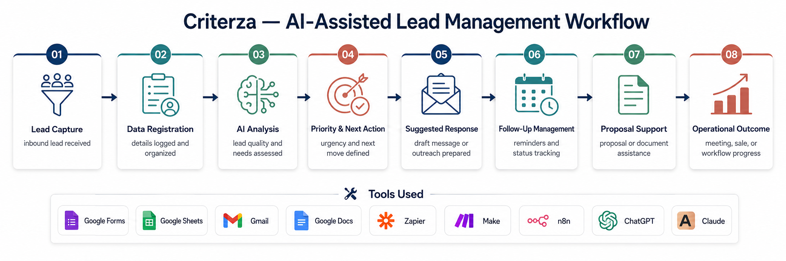

# AI-Assisted Lead Management Workflow

## Overview

This is a personal learning project created to practice AI operations, workflow automation, and no-code/low-code process design.

The project simulates how a service business can capture leads, organize information, classify opportunities, generate suggested responses, manage follow-ups, and support proposal creation using an AI-assisted workflow.

This is not a production system. It is a portfolio project built to demonstrate process thinking, automation logic, documentation, and practical AI implementation.

---

## Portfolio Assets

* [Portfolio HTML](./portfolio.html)
* [Portfolio PDF](./portfolio.pdf)
* [Workflow Diagram](./workflow-diagram.png)

---

## Workflow Diagram

---

## Problem

Many small service businesses receive leads through different channels, but the information is often disorganized.

Common issues include:

* Leads are not properly registered
* Follow-ups are missed
* Lead priority is unclear
* Responses take too much manual work
* Proposal preparation is repetitive
* Commercial information is difficult to track
* Teams lose time doing repetitive manual tasks

---

## Solution

The workflow was designed to organize the full lead management process from lead intake to proposal support.

The system flow includes:

1. Lead Capture
2. Data Registration
3. AI Analysis
4. Priority & Next Action
5. Suggested Response
6. Follow-Up Management
7. Proposal Support
8. Operational Outcome

The goal is to create a simple and reusable workflow that helps a business respond faster, reduce manual work, and maintain better commercial traceability.

---

## Tools Used

* Make
* Google Forms
* Google Sheets
* Gmail
* Google Docs
* ChatGPT
* Claude

---

## Workflow Logic

A lead submits an inquiry through a form, email, or landing page.

The information is then saved in a CRM-style Google Sheet, where the lead data can be reviewed, organized, and tracked.

AI is used to help summarize the lead, understand the business need, classify the opportunity by priority, and suggest the next commercial action.

The workflow also supports the follow-up process by helping generate suggested responses, record follow-up status, and connect lead information to a proposal template.

---

## Example Workflow

1. A new lead is captured.
2. The lead data is registered in Google Sheets.
3. AI analyzes the inquiry and summarizes the context.
4. The lead is classified as high, medium, or low priority.
5. A recommended next action is generated.
6. A suggested email or message response is prepared.
7. Follow-up status and next steps are recorded.
8. The information can be used to support proposal creation.

---

## Expected Impact

The expected impact of this workflow is to:

* Reduce manual work
* Improve response speed
* Organize lead information
* Support better follow-up
* Create commercial traceability
* Help teams work with more clarity
* Build a reusable AI-assisted operations workflow

---

## What I Practiced

Through this project, I practiced:

* Process mapping
* Workflow design
* AI-assisted operations
* No-code/low-code automation logic
* CRM-style data organization
* Prompt design for business workflows
* Documentation of operational processes
* Translating a business problem into a practical automation flow

---

## Project Status

This is an active learning project.

The first version was built and documented using Make, Google Workspace, and AI tools.

Next improvements:

* Replicate the workflow in Zapier
* Replicate the workflow in n8n
* Add screenshots of the Make scenario
* Add a short Loom walkthrough
* Improve AI prompt structure
* Add sample anonymized data
* Document workflow errors and improvements

---

## About Me

My name is Juan Pablo Meyer.

I come from a background in commercial operations, process documentation, business management, and digital tools.

I am currently transitioning into AI automation and no-code/low-code implementation, focusing on practical workflows that help teams reduce repetitive tasks, organize information, improve follow-up, and work more efficiently.

My goal is to grow into roles such as AI Operations Specialist, AI Automation Specialist, No-Code Automation Specialist, or Operations Automation Specialist.
